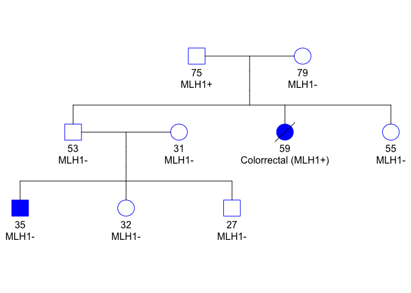

Árboles genealógicos con R
================
William Hoyos

Se usará el paquete kinship2 para la creación de árboles genealogicos
con R. Primero cargamos la librería o paquete en mención:

``` r
library(kinship2)
```

    ## Loading required package: Matrix

    ## Loading required package: quadprog

Para este ejercicio creamos un data frame con los
datos:

``` r
id <- c("padre1", "madre1", "hijo1", "hijo2","hijo3", "esposa_hijo1", "hijo1_hijo1", 
        "hijo2_hijo1", "hijo3_hijo1")
father <- c(NA, NA, "padre1", "padre1", "padre1", NA, "hijo1", "hijo1", "hijo1")
mother <- c(NA, NA, "madre1", "madre1", "madre1", NA, "esposa_hijo1", "esposa_hijo1", 
            "esposa_hijo1")
ages <- c(75, 79, 53, 59, 55, 31, 35, 32, 27)
affected <- c(0, 0, 0, 1, 0, 0, 1, 0, 0)
sex <- c(1, 2, 1, 2, 2, 2, 1, 2, 1)
status <- c(0, 0, 0, 1, 0, 0, 0, 0, 0)
gen <- c("MLH1+", "MLH1-", "MLH1-", "Colorrectal (MLH1+)", "MLH1-", "MLH1-","MLH1-",
         "MLH1-","MLH1-")

my_family <- data.frame(id, father, 
                         mother, affected, 
                         sex, ages, status, gen)
```

Luego creamos un objeto de tipo pedigree:

``` r
my_ped <- pedigree(
        id = my_family$id,
        dadid = my_family$father,
        momid = my_family$mother,
        sex = my_family$sex,
        affected = my_family$affected,
        status = my_family$status
)

ages_genes <- paste(my_family$ages, my_family$gen, sep = "\n")
```

Por último, realizamos el árbol con la función plot.pedigree():

``` r
plot.pedigree(my_ped, symbolsize = 1, col = "blue", id = ages_genes)
```

<!-- -->
